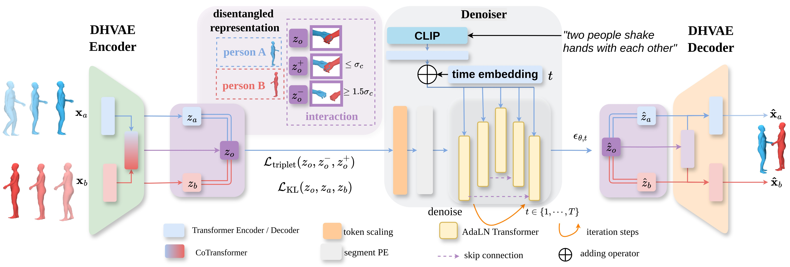

# Disentangled Hierarchical VAE for 3D Human-Human Interaction Generation


<center>
ICLR 2026
</center>

---
This is the official-implementation of [Disentangled Hierarchical VAE for 3D Human-Human Interaction Generation](https://openreview.net/forum?id=53eIDko6N5) (DHVAE) for Human-Human Interaction.





## 🧩 Project Structure

```bash
ARMFLOW/
├── cfg/              # Configuration files
├── ckpt/             # ckeckpoints
├── data/             # Dataset directory (containing interhuman/, interx/, and stats/ for interx)
├── datasets/         # Dataset loading and preprocessing scripts
├── eval/             # evaluators
├── models/           # Model definitions
├── utils/            # Utility functions
├── train/            # Main training script
├── test/             # test and eval script
└── vis/              # Visualization script
```
---
## ⚙️ Environment Setup

```bash
conda env create -f environment.yml
conda activate dhvae
```

Then create the `deps` folder.
```bash
mkdir deps
```
Once you run evaluation or training code, the `ViT-L-14-336px.pt` will be downloaded to it automatically.

---

## 📦 Dataset Preparation
1. InterHuman

``` bash
# Step 1. Download the InterHuman dataset from:
# https://github.com/tr3e/InterGen

# Step 2. Organize the dataset as follows:
data/interhuman/
├── annotations_interhuman/
├── annots/
├── contact.pt # contact label.
├── checkpoints/ # the feature extractor checkpoints for Interhuman. 
├── train.txt
├── test.txt
├── val.txt
├── motions/
├── motions_processed/
└── split/
```
please download the [contact.pt](https://drive.google.com/file/d/1-8rRh_LycAy6d9sBk-CgjjKhMuD_kJxM/view?usp=sharing)


## 🚀 Training

This section explains how to train our model in two steps.

### 1. InterHuman

> CHVAE training
```bash
python -m train.chmld.train_chvae
```
Please change the `mld.name` in the `cfg/chmld/chmld.yaml` if needed. 

> CHMLD training
```bash
python -m train.chmld.train_chmld
```


## 📖 Evaluation

### 1. Evaluation on InterHuman Dataset

> Download [pretrained model](https://drive.google.com/drive/folders/1Kn9SxE5VqGnqurobZ9536NWpNPjop3s2?usp=sharing) and put them in the __ckpt__ folder
  The folder structure should be like

``` bash
ckpt/
├── chvae_d256_n4_3_l1_cat/
└── chmld_best/
```

> Run the evaluation script by

``` bash
python -m test.eval_chmld mld.name=chmld_best mld.is_best=epoch=1169-fid=4.9035.ckpt
```

## 📝 TODO
- [x] Release the model.
- [x] Release training code on InterHuman Dataset
- [x] Release evaluation scripts on InterHuman Dataset
- [x] Release evaluation pretrained checkpoints on InterHuman Dataset
- [ ] Release the implementation on the InterX dataset
- [ ] Finalize the visualization scripts and dependencies. 


## 🤝 Acknowlegements
We stand on the shoulders of giants. This project builds upon a rich body of prior work in human motion modeling, generative modeling, and representation learning.  We sincerely thank the open-source community and all researchers whose insights and released code made this work possible. [InterGen](https://github.com/tr3e/InterGen), [Inter-X](https://github.com/liangxuy/Inter-X), [in2IN](https://github.com/pabloruizponce/in2IN), [InterMask](https://github.com/gohar-malik/intermask), [VAR](https://github.com/FoundationVision/VAR), [MLD](https://github.com/ChenFengYe/motion-latent-diffusion).

And thanks to the support 💰 by the Australian Research Council (ARC) Discovery Project DP240101926. We gratefully acknowledge this support.

